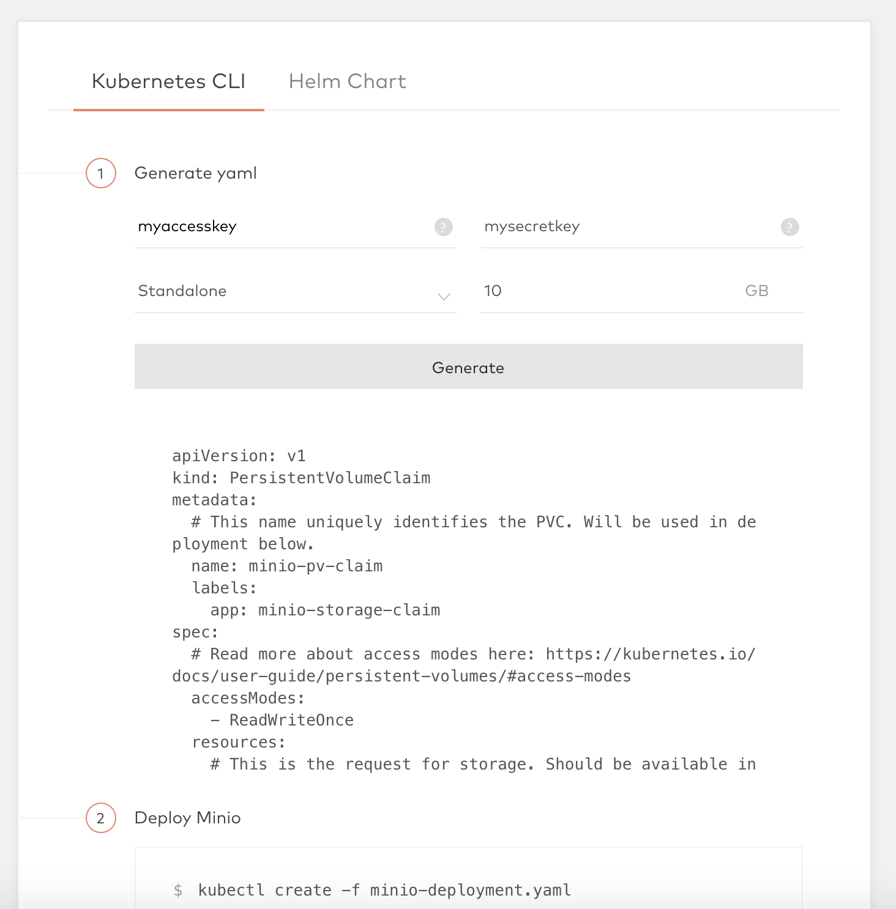
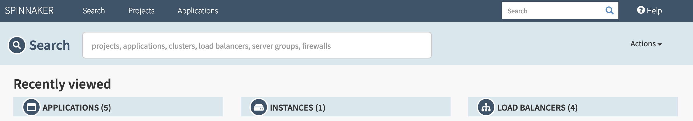
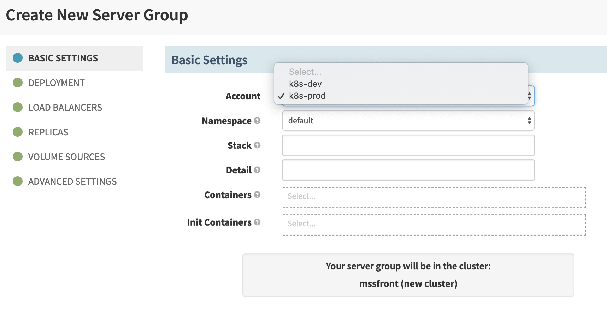

# Spinnaker 설치하기

Halyard는 Spinnaker 배포를 위한 설정(Configuration)을 하고 설정에 따라 배포되도록 도와주는 관리 도구입니다. 
Halyard CLI를 통해 Spinnaker를 어디에 배포할 지, 어떻게 구성할 지 등에 대한 설정을 한 뒤에 간단한 CLI 커맨드를 통해 Spinnaker를 실행시킬 수 있습니다. 

Spinnaker를 AWS, Azure 등과 같은 여러가지 Provider에 배포할 수 있는데 여기에서는 Kubernetes Cluster에 Spinnaker를 배포하도록 하겠습니다. 

## 1. 먼저, Halyardinstall 스크립트를 실행합니다. 

```sh
$ curl -O https://raw.githubusercontent.com/spinnaker/halyard/master/install/macos/InstallHalyard.sh
$ sudo bash InstallHalyard.sh
```

설치가 제대로 되었으면 아래 명령어를 통해 버전정보를 확인할 수 있습니다. 
```sh
$ hal -v
1.15.0-20190206103304
```

## 2. Spinnaker가 배포 될 Provider를 선택하고 Account 추가 
Spinnaker가 배포 될 k8s 클러스터를 Spinnaker account에 등록합니다. 

```sh
$ hal config provider kubernetes enable
```

Provider-version은 v1,v2가 있습니다. (버전별 차이는 'Provider Version' 참고. 저는 Private Docker Registry를 사용했기 때문에 v1 버전을 사용했습니다.)

### - V1 
#### docker-registry account 추가
  - DockerHub를 사용하는 경우  
    ```sh
    hal config provider docker-registry account add {dockerhub} --address=index.docker.io
    ```
  - Private Docker Registry를 사용하는 경우 
    ```sh
    hal config -d provider docker-registry account add {my-registry} --username {USER-NAME} --password --address {my.dockeraddress.com}
    ```
#### Provider account 추가 
kubernetes config에서 현재 관리하고 있는 클러스터의 Context 정보를 확인해서 account에 등록합니다. (k8s Context 정보는 'Kubernetes Config 설정 및 Context 관리' 참고)
  ```sh
  hal config provider kubernetes account add {my-k8s-v1} --provider-version v1 --context={K8S-CONTEXT-NAME} --docker-registries={my-registry}
  ```
### - V2
DockerHub를 레지스트리로 사용할 경우 v2에서는 따로 docker-registry account를 추가하지 않아도 됩니다.
v2는 v1과 달리 docker-registry acccount가 필수값이 아닙니다.  
```sh
$ hal config provider kubernetes account add {my-k8s-v2} \
    --provider-version v2 \
    --context {K8S-CONTEXT-NAME}
```      

등록된 account list 확인
```sh
hal config provider kubernetes account list
```

## 3. Spinnaker가 배포 될 Environment 선택 
위에서 추가한 account 중에서 Spinnaker가 설치 될 account 명을 등록합니다. 
여기에서 선택한 k8s 클러스터 환경에 Spinnaker namespace가 생성되고 관련 리소스들이 올라갑니다. 
```sh
hal config deploy edit --type distributed --account-name {my-k8s-v1}
```

## 4. Spinnaker 정보를 저장 할 Storage 구축 
Spinnaker 셋팅정보나 파이프라인 정보등을 저장하기 위해서 external storage가 필요합니다. 
host storage를 사용하기 위해 minio를 사용하였습니다. 

### 4-1. 먼저. default provisioner가 없다면 아래 참고하여 nfs를 만듭니다.  

https://github.com/kubernetes-incubator/external-storage/tree/master/nfs/deploy/kubernetes

```sh
kubectl create ns spinnaker
kubectl create -f psp.yaml --namespace=spinnaker
kubectl create -f rbac.yaml --namespace=spinnaker
kubectl create -f deployment.yaml --namespace=spinnaker
kubectl create -f class.yaml --namespace=spinnaker
kubectl create -f claim.yaml --namespace=spinnaker
kubectl get pv
```

### 4-2. minio 생성

https://www.minio.io/에서 원하는 방법을 사용하여 생성합니다. 

KUBERNETES에 생성할 것이라서 메인페이지에서 Kubernetes를 선택하고 정보를 추가합니다. 



생성된 manifest에서 'namespace spinnaker' 정보만 추가했습니다. 
```yaml
apiVersion: v1
kind: PersistentVolumeClaim
metadata:
  # This name uniquely identifies the PVC. Will be used in deployment below.
  name: minio-pv-claim
  namespace: spinnaker
  labels:
    app: minio-storage-claim
  ...
---
apiVersion: extensions/v1beta1
kind: Deployment
metadata:
  # This name uniquely identifies the Deployment
  name: minio-deployment
  namespace: spinnaker
  ...
```

아래와 같이 생성 된 리소스를 확인합니다. 
```sh
$ kubectl get pvc
NAME             STATUS   VOLUME                                     CAPACITY
minio-pv-claim   Bound    pvc-d2785314-3647-11e9-914e-7085c2521d34   10Gi  
$ kubectl get pv
NAME                                       CAPACITY   ACCESS MODES   RECLAIM POLICY   STATUS   CLAIM
pvc-d2785314-3647-11e9-914e-7085c2521d34   10Gi       RWO            Delete           Bound    spinnaker/minio-pv-claim
$ kubectl get pod -n spinnaker
NAME                                    READY   STATUS    RESTARTS   AGE
minio-deployment-8464dcd847-9sgcp       1/1     Running   0          7h9m
$ kubectl get svc -n spinnaker
NAME                         TYPE        CLUSTER-IP       EXTERNAL-IP   PORT(S)          
minio-service                NodePort    10.103.55.12     <none>        9000:31332/TCP    
```

Spinnaker에 Storage 정보를 추가합니다. key정보에는 아까 minio manifest에서 생성한 정보를 넣어줍니다. 
```sh
echo {minio-secretkey} | hal config storage s3 edit --endpoint http://minio-service:9000 \
    --access-key-id {minio-access-key} \
    --secret-access-key
```
```sh    
hal config storage edit --type s3
```

5. Deploy and Connect
version list 명령어로 가능한 버전정보를 확인하고 설정해줍니다. 
```sh
hal version list
hal config version edit --version 1.12.X
```
hal로 설정한 정보가 반영된 Spinnaker를 단계3에서 선택한 Environment에 배포합니다. 
```sh
hal deploy apply
```
배포가 끝나면 아래와 같이 모든 Pod들이 Running 상태가 됩니다. 

```sh
$ kubectl get po -n spinnaker
NAME                                    READY   STATUS    RESTARTS   AGE
minio-deployment-8464dcd847-9sgcp       1/1     Running   0          7h14m
nfs-provisioner-58b4857587-h9pqz        1/1     Running   0          7h14m
spin-clouddriver-bootstrap-v000-9wnwn   1/1     Running   0          153m
spin-clouddriver-v001-jk6fw             1/1     Running   0          152m
spin-deck-v001-g69mp                    1/1     Running   0          152m
spin-echo-v001-zxs2q                    1/1     Running   0          152m
spin-front50-v001-74pkq                 1/1     Running   0          152m
spin-gate-v001-pvqwb                    1/1     Running   0          152m
spin-igor-v001-wqg8q                    1/1     Running   0          152m
spin-orca-bootstrap-v000-xwn4q          1/1     Running   0          152m
spin-orca-v001-mx2mg                    1/1     Running   0          152m
spin-redis-bootstrap-v000-gx524         1/1     Running   0          153m
spin-redis-v000-5np6s                   1/1     Running   0          7h6m
spin-rosco-v001-mkdhl                   1/1     Running   0          152m
```

Connect 명령으로 spin-front50으로 접속할 수 있도록 포트포워딩을 합니다. 
```sh
hal deploy connect
```

{environment-ip}:9000으로 Spinnaker UI에 접속합니다. 




# 참고 

## docker Kubernetes 사용 시 이슈
kube config에 docker for docker cluster 정보가 localhost라서 배포가 안됨. 
```sh
kubectl config set-cluster docker-for-desktop-cluster --insecure-skip-tls-verify=true
```

## 다중 Cluster에 배포할 때 
Spinnaker에서 각각의 dev, stage, prod 클러스터에 배포할 경우 Account를 추가하고 Deploy를 합니다. 
예를들어, 아래와 같이 두 개의 account를 생성했다면 
```sh
$ hal config provider kubernetes account add {k8s-dev} --provider-version v1 --context={STG-K8S-CONTEXT-NAME} --docker-registries={my-registry}
$ hal config provider kubernetes account add {k8s-prod} --provider-version v1 --context={PROD-K8S-CONTEXT-NAME} --docker-registries={my-registry}
```
Spinnaker UI에서 리소스 생성 시 아래와 같이 원하는 account를 선택하여 배포할 수 있습니다. 



## Public IP, DNS 사용 시
Front에서 Gate로 API 요청 시 같은 호스트 정보로 호출하기 때문에 동일하지 않으면(다른 호스트 또는 다른 아이피) 아래와 같이 추가

hal config security ui edit \
    --override-base-url http://spinnaker.mydomain.org:9000

hal config security api edit \
    --override-base-url http://spinnaker.mydomain.org:8084 

https://blog.spinnaker.io/exposing-spinnaker-to-end-users-4808bc936698

## Provider Version 
provider-version은 현재 v1(legacy), v2(manifest) 두 가지가 있습니다. (2019-02 기준) 
  - v1 : Spinnaker UI에서 미리 지정된 템플릿 기반으로 k8s 리소스를 생성 
  - v2 : 텍스트 기반으로 yaml을 직접 입력하여 리소스 생성 

또한, Private Docker Registry를 사용하려고 할 때 docker-registry account를 추가하면 K8s에서 생성되어 있는 모든 namespace에 secret 리소스를 만들고, 
Spinnaker에서 Pod을 배포할 때 템플릿에 ImagePullSecret 정보를 자동으로 넣어주는데 v2에서는 제대로 작동하지 않습니다.  
(https://github.com/spinnaker/spinnaker/issues/3850)   

## ImagePullSecret 미 생성 이슈 
v1을 사용할 경우 ImagePullSecret 정보를 모든 namespace에 넣어주는데, 배포 당시에 존재하는 namespace에만 자동생성하기 때문에 
배포 후에 namespace를 생성하면 secret 정보가 없음 

## Kubernetes Config 설정 및 Context 관리
 ```sh
$ kubectl config view 
apiVersion: v1
clusters:
- cluster:
    certificate-authority: $HOME/.minikube/ca.crt
    server: https://192.168.99.100:8443
  name: minikube
- cluster:
    certificate-authority-data: DATA+OMITTED
    server: https://XXX.XXX.XX.XX:6443
  name: kubernetes
contexts:
- context:
    cluster: kubernetes
    user: kubernetes-admin
  name: kubernetes-admin@kubernetes
current-context: kubernetes-admin@kubernetes
- context:
    cluster: minikube
    user: minikube
  name: minikube
kind: Config
preferences: {}
users:
- name: kubernetes-admin
  user:
    client-certificate-data: REDACTED
    client-key-data: REDACTED
- name: minikube
  user:
    client-certificate: $HOME/.minikube/client.crt
    client-key: $HOME/.minikube/client.key
```

예를들면, 위 샘플 config를 보면 현재 관리되고 있는 k8s 클러스터는 minikube, kubernetes 두 개입니다.  
current-context는 kubernetes-admin@kubernetes로 되어있기 때문에 kubectl로 명령어를 실행하면 해당하는 K8s API 서버(https://XXX.XXX.XX.XX:6443) 로 호출됩니다. 
config 정보는 kubectl CLI를 통해 변경할 수도 있고(https://kubernetes.io/docs/tasks/access-application-cluster/configure-access-multiple-clusters/), ~/.kube/config 파일을 직접 수정하여 변경할 수도 있습니다. 
