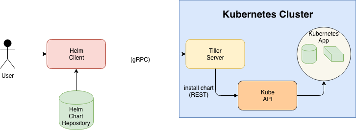
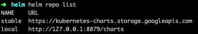
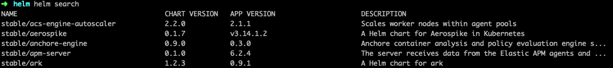
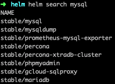
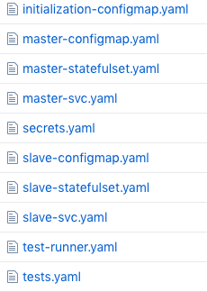
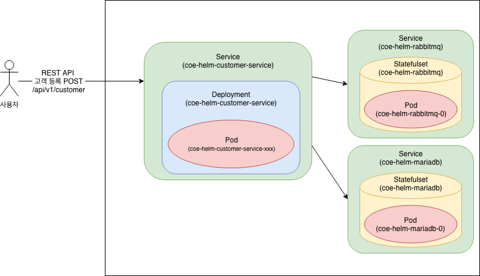
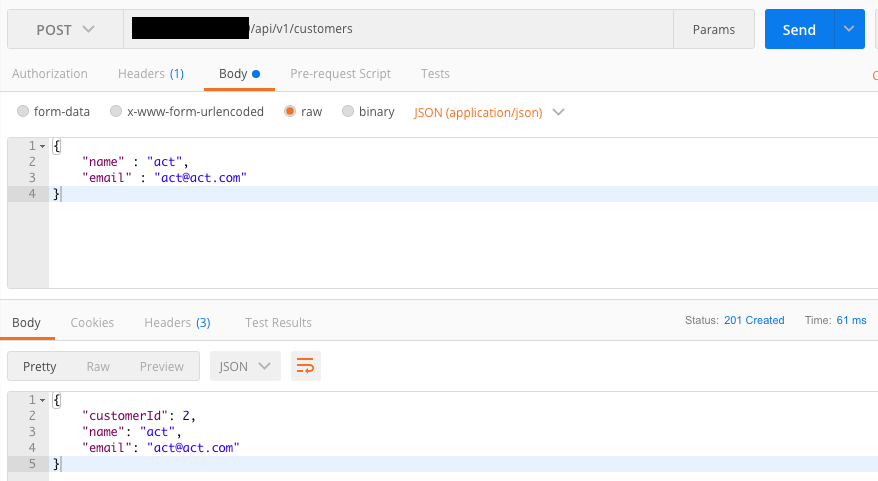
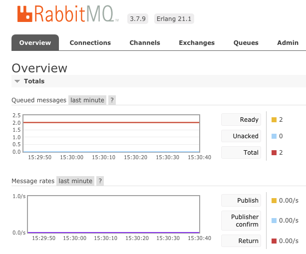

# Helm

Helm은 쿠버네티스 어플리케이션 관리를 도와주는 관리 툴입니다.

Helm은 Chart를 제공하는데 이 Chart는 사전에 구성 된 쿠버네티스 리소스 패키지입니다.

따라서 사용자는 복잡한 쿠버네티스 어플리케이션을 정의하고 설치 및 업그레이드 할 수 있습니다.

차트를 통해서 버전을 만들고 다른 사람과 공유하며 게시 할 수 있기 때문에

복사하고 붙여넣기의 반복된 작업을 벗어나게 해줍니다.

Helm을 아래와 같이 이용 할 수 있습니다.

* 사전에 제공되는 인기 있는 소프트웨어를 찾아서 현재 사용중인 쿠버네티스 클러스터에 적용 할 수 있습니다. (ex EFK)

* 사용자의 완성된 쿠버네티스 어플리케이션을 Chart로 만들어서 공유를 할 수 있습니다.

* 재구성 가능한 쿠버네티스 응용 프로그램을 만들 수 있습니다.

* 조금 더 똑똑하게 쿠버네티스의 manifest 파일을 관리 할 수 있습니다.

* Helm 패키지의 릴리즈 관리가 가능합니다.

## 1. 구성

Helm은 위에서 설명 하였듯이 쿠버네티스의 응용 프로그램 설치 및 관리를 편하게 해주는 도구입니다.

쉽게 apt / yum / homebrew와 같은 패키지 설치 툴이라고 생각하면 되겠습니다.

* Helm은 client(helm)과 server(tiller) 두 부분으로 나눌 수 있습니다. 서로 gRPC로 통신을 하게 됩니다.

* server인 tiller는 쿠버네티스 클러스터 내부에서 실행 되며 차트의 릴리즈(설치)를 관리 합니다.

* client인 helm은 사용자가 원하는 어떠한 곳(데스크탑, CI/CD 등)에서도 실행이 가능합니다.

* 차트는 적어도 두가지를 포함하는 Helm 패키지입니다.

  * 패키지에 대한 설명을 담당하는 Chart.yaml이 있습니다.

  * 쿠버네티스의 manifest 파일을 포함하는 하나 이상의 템플릿이 있습니다.

* 이러한 차트는 디스크 또는 원격 차트 저장소에서 가져올 수 있습니다.

## 2. 설치

### 2.1 클라이언트(Helm) 설치

Helm 클라이언트를 설치 하는 방법은 아래와 같습니다.

* 릴리즈된 바이너리를 다운 받아서 설치

* homebrew, snap과 같은 패키지 툴을 이용하여 설치

* 스크립트를 이용한 설치

* 소스를 직접 설치

아래 링크를 참조하여 본인의 환경에 맞는 helm 클라이언트를 설치합니다.
https://docs.helm.sh/using_helm/#installing-helm

### 2.2 Tiller 설치

Tiller를 클러스터에 설치하는 가장 쉬운 방법은 아래의 명령어를 실행하는 것입니다.

~~~bash
$ helm init
~~~

해당 명령어는 로컬 환경이 올바르게 설정 되어 있는지 자체적으로 확인합니다.

그런 다음 kubectl이 기본적으로 연결하는 모든 클러스터에 연결을 합니다.

연결이 정상적으로 되었다면 kube-system 네임스페이스에 tiler가 설치가 됩니다.

## 3. mariadb 실행

### 3.1 repo 정보 조회
~~~bash
$ helm repo list
~~~

위의 명령어를 실행하면 현재 helm이 바라보는 chart 저장소를 보여줍니다. 기본적으로 stable 저장소를 바라보고 있습니다.

### 3.2 repo의 차트 정보 조회

~~~bash
$ helm search
~~~

위의 명령어를 실행하면 차트 저장소에 저장된 차트 목록들을 아래와 같이 보여줍니다.

만약 특정 차트를 검색하고 싶다면 아래와 같은 명령어를 실행하도록 합니다.

~~~bash
$ helm search [차트이름]
~~~

만약 mysql이라고 검색을 하게 되면

아래와 같이 mysql이 아닌 차트(ex mariadb)도 보여주게 되는데

이유는 패키지의 설명이 MySQL과 관련되어 있기 때문입니다.

~~~bash
$ helm inspect stable/mariadb
~~~

위의 명령어를 사용하게 되면 keywords 부분에 MySQL이 있음을 확인 할 수 있습니다.

### 3.3 mariadb 설치

helm으로 mariadb를 설치하는 명령은 아래와 같습니다.

~~~bash
$ helm install stable/mariadb
~~~

stable repository에 mariadb를 가져와서 설치합니다.

설치시 파라미터를 넘겨 줄 수 있는데 해당 파라미터는 차트에 정의된 values.yaml을 오버라이딩 하게 됩니다.

stable 내의 차트에 대한 정보는 [이곳](https://github.com/helm/charts/tree/master/stable)에서 확인을 할 수 있는데

이 곳에서 mariadb로 이동하게 되면

--set 옵션을 이용하여 root password 등의 정보를 설정 할 수 있는 것을 확인 할 수 있습니다.

아래의 명령어를 실행하여 mariadb를 실행합니다.

~~~bash
helm install --name test-maria --set rootUser.password=test \
 --set rootUser.forcePassword=true \
 --set db.user=test \
 --set db.password=test \
 --set db.forcePassword=true \
 --set replication.password=test \
 --set replication.forcePassword=true \
 stable/mariadb
~~~

### 3.4 설치된 릴리즈 목록 확인

이후 아래 명령어를 실행하게 되면 현재 쿠버네티스 클러스터에 실행중인 릴리즈 목록을 확인 할 수 있습니다.

~~~bash
// helm list -a [release name]
$ helm list -a test-maria
NAME      	REVISION	UPDATED                 	STATUS  	CHART        	APP VERSION	NAMESPACE
test-maria	1       	Tue Nov 27 18:44:20 2018	DEPLOYED	mariadb-5.2.3	10.1.37    	default
~~~

실행한 mariadb 차트의 template 안의 목록을 보면 아래와 같은데

실제로 클러스터 내에서 위의 목록들이 생성 됨을 아래 명령어를 통해서 알 수 있습니다.

~~~bash
$ kubectl get all,secret,cm -l release=test-maria

NAME                              READY   STATUS    RESTARTS   AGE
pod/test-maria-mariadb-master-0   1/1     Running   0          36m
pod/test-maria-mariadb-slave-0    1/1     Running   0          36m

NAME                               TYPE        CLUSTER-IP       EXTERNAL-IP   PORT(S)    AGE
service/test-maria-mariadb         ClusterIP   10.96.68.144     <none>        3306/TCP   36m
service/test-maria-mariadb-slave   ClusterIP   10.104.189.147   <none>        3306/TCP   36m

NAME                                         DESIRED   CURRENT   AGE
statefulset.apps/test-maria-mariadb-master   1         1         36m
statefulset.apps/test-maria-mariadb-slave    1         1         36m

NAME                        TYPE     DATA   AGE
secret/test-maria-mariadb   Opaque   3      36m

NAME                                  DATA   AGE
configmap/test-maria-mariadb-master   1      36m
configmap/test-maria-mariadb-slave    1      36m
~~~

만약 설정 정보 전체를 확인하고 싶다면 아래의 명령을 실행합니다.

~~~bash
$ helm get test-maria
REVISION: 1
RELEASED: Tue Nov 27 18:44:20 2018
CHART: mariadb-5.2.3
USER-SUPPLIED VALUES:
db:
  forcePassword: true
  password: test
  user: test
replication:
  forcePassword: true
  password: test
rootUser:
  forcePassword: true
  password: test

COMPUTED VALUES:
...
...
HOOKS:
---
apiVersion: v1
kind: Pod
metadata:
  name: "test-maria-mariadb-test-rk7la"
  annotations:
    "helm.sh/hook": test-success
spec:
...
...
~~~

> 물론 원격 레파지토리의 차트 뿐만 아니라 해당 레파지토리를 다운 받아서 수정을 직접하여 실행 할 수 있습니다.
> fetch 명령을 통해서 해당 레파지토리로부터 압축파일을 다운 받아서 압축을 해제 한 이후 실행합니다.
>~~~bash
> $ helm fetch stable/mariadb
> $ tar zxvf mariadb-5.2.3.tgz
> //values.yml 등의 정보 수정 이후
> $ helm install ./mariadb
>~~~

### 3.6 mariadb 접속

위에서 설정한 정보들(비밀번호, 데이터베이스)이 정상적으로 설정 되었는지 아래와 같이 접속해서 확인합니다.

~~~bash
$ kubectl exec -it test-maria-mariadb-master-0 bash
I have no name!@test-maria-mariadb-master-0:/$ mysql -u root -p
Enter password: //비밀번호 test 입력

Welcome to the MariaDB monitor.  Commands end with ; or \g.
Your MariaDB connection id is 527
Server version: 10.1.37-MariaDB Source distribution

Copyright (c) 2000, 2018, Oracle, MariaDB Corporation Ab and others.

Type 'help;' or '\h' for help. Type '\c' to clear the current input statement.

MariaDB [(none)]> show databases;
+--------------------+
| Database           |
+--------------------+
| information_schema |
| my_database        |
| mysql              |
| performance_schema |
| test               |
+--------------------+
5 rows in set (0.02 sec)
~~~

## 4. Chart 생성

위에서는 기존에 만들어진 차트를 쿠버네티스 클러스터에 실행하는 법을 확인하였습니다.

아래에서는 사용자가 자신만의 차트를 만드는 법을 확인하도록 하겠습니다.

### 4.1 chart create

~~~bash
$ helm create customer-service
Creating customer-service
~~~

customer-service라는 폴더가 생성 되고 해당 폴더에는 아래와 같은 파일과 폴더를 가집니다.

~~~bash
$ ls customer-service
Chart.yaml  charts  templates  values.yaml
~~~

### 4.2 chart 구조

Helm은 charts라는 패키징 형식을 사용합니다.

이와 같은 쿠버네티스 관련 리소스들을 설명하는 파일들의 모음입니다.

위에서 생성된 파일들을 수정하여 패키지화 하여 배포할 수 있습니다.

위에서 생성된 create-chart안의 파일과 추가할 수 있는 파일은 아래와 같습니다.

* Chart.yaml - chart에 대한 정보를 포함하는 파일입니다.

* LICENSE - chart의 라이센스가 기술된 파일입니다.(옵션)

* README.md - 사용자들이 읽을 수 있는 단순한 README 파일입니다.(옵션)

* requirements.yaml - chart간 의존성들이 적혀 있는 파일입니다.(옵션)

* values.yaml - 차트의 기본 설정 정보를 담고 있는 파일입니다.

* charts 디렉토리 - 해당 차트가 의존하는 모든 차트가 들어 있는 디렉토리입니다.

* templates 디렉토리 - values에 정의된 설정값과 합쳐져서 쿠버네티스 manifest 파일을 생성하는 디렉토리입니다.

* templates/NOTES.txt - 사용자에게 사용방법을 알려주는 파일입니다.(옵션)

### 4.3 chart 만들기

구성할 구조는 아래와 같습니다.

고객이 등록 요청을 하게 되면 고객의 정보를 받아서 rabbitmq와 mariadb에 정보를 넣는 구조입니다.

mariadb와 rabbitmq의 경우 stable 레파지토리에서 제공되는 차트를 이용 할 것입니다.

물론 각각 새로 생설할 customer-service 차트와 mariadb 차트, rabbitmq 차트를 다 별도로 실행시켜도 되지만

customer-service의 경우 mariadb와 rabbitmq에 종속성이 있기 때문에 위에서 설명드린 charts 디렉토리에 두개의 차트를 넣어서 기동해보도록 하겠습니다.

먼저 4.1에서 생성한 디렉토리안의 charts 폴더에

~~~bash
$ helm fetch [차트명]
~~~

와 같은 명령어를 이용해 종속성이 있는 차트를 넣어줍니다.

> 물론 requirements.yaml에 필요한 종속성 차트를 기입하고 dep up 명령어를 사용하셔도 됩니다.

만약 위와 같이 하였다면 아래와 같은 폴더 구조를 가지게 됩니다.

~~~
customer-service
  Chart.yaml
  values.yaml
  charts
      mairadb
        ...
      rabbitmq
        ...
  templates
      deployment.yaml
      service.yaml
      ...
~~~

customer-service는 스프링 부트 어플리케이션입니다.

application.yml에서 rabbitmq와 datasource 부분을 아래와 같이 수정합니다.

해당 소스는 coe-samle-service 에 helm 브랜치에 존재합니다.

~~~yml
spring:
  rabbitmq:
      host: ${RABBITMQ_SERVER_URL:coe-helm-rabbitmq}
      port: ${RABBITMQ_SERVER_PORT:5672}
      username: username
      password: password
  datasource:
      sql-script-encoding: UTF-8
      driverClassName: org.mariadb.jdbc.Driver
      url: jdbc:mariadb://coe-helm-mariadb:3306/coe
      username: ${DB_USERNAME:root}
      password: ${DB_PASSWORD:root}
~~~

이후 빌드 및 도커 빌드, 푸쉬를 통하여 도커 이미지를 업로드합니다.

다음으로

customer-service/charts/mariadb/values.yaml 파일을 열어서

아래와 같이 수정을 합니다.

~~~yaml
..
rootUser:
  password: root
  forcePassword: true
db:
  user: coe
  password: coe
  name: coe
  forcePassword: true
replication:
  enabled: false
  ..
master:
  ..
  persistence:
    enabled: false
  ..
~~~

다음으로 customer-service/charts/rabbitmq/values.yaml 파일을 열어서 아래와 같이 수정합니다.

~~~yaml
..
rabbitmq:
  username: username
  password: password
  ..
service:  
  type: NodePort
  ..
persistence:
    enabled: false
  ..
~~~

이제 customer-service/values.yaml 파일을 열어서 아래와 같이 수정합니다.

~~~yaml
...
image:
  repository: 도커 이미지 위치
  tag: 도커 이미지 태그
  pullPolicy: Always
...
service:
  type: NodePort
  port: 8080

initContainer:
  mariadb:
    name: coe-helm-mariadb:3306
    image:
      repository: bitnami/mariadb
      tag: 10.1.37
    password: root
ingress:
  enabled: false
...
~~~

위에서 initContainer 부분은 customer-service가 작동 할 때 mariadb가 정상적으로 기동 되었는지 확인 하기 위한 변수입니다.

해당 변수 사용은 customer-service/templates/deployment.yaml 에서 사용됩니다.

~~~yaml
apiVersion: apps/v1beta2
kind: Deployment
metadata:
  ...
  ...
spec:
  ...
  template:
    ...
    spec:
      initContainers:
        - name: init-mariadb
          image: "{{ .Values.initContainer.mariadb.image.repository }}:{{ .Values.initContainer.mariadb.image.tag }}"
          command: ['sh', '-c', 'until mysqladmin status -uroot -proot -h coe-helm-mariadb; do echo waiting for mariadb; sleep 2; done;']
      containers:
          ...
            ports:
              - name: http
                containerPort: 8080
                protocol: TCP

~~~

deployment의 pod 생성 전에 initContainer를 이용하여 해당 서비스가 바라보는 mariadb가 정상적으로 작동 되었는지 확인합니다.
정상적으로 mariadb가 기동이 되었다면 containers에 기술된 이미지들이 팟으로 기동됩니다.

이후 작성한 차트의 문법이 정상적인지 확인하기 위해서 아래의 명령어를 실행합니다.

~~~bash
//customer-service 경로에서 실행
$ helm lint .
==> Linting .
[INFO] Chart.yaml: icon is recommended

1 chart(s) linted, no failures
~~~

문법에 문제가 없다면 아래의 명령을 통해서 helm 차트를 설치합니다.

~~~bash
//customer-service 경로에서 실행
$ helm install -n coe-helm .
~~~

정상적으로 실행이 되었다면 postman등의 툴을 이용하여 고객 등록을 해봅니다.

정상적으로 response가 왔으면 rabbitmq에서 정상적으로 큐에 들어갔는지 확인합니다.

마지막으로 mariadb에 정상적으로 데이터가 들어갔는지 확인합니다.

~~~bash
kbuectl exec -it coe-helm-mariadb-0 bash

Command 'kbuectl' not found, did you mean:

 command 'kubectl' from snap kubectl (1.12.2)

See 'snap info <snapname>' for additional versions.

actmember@act-kube-master:~/helmtest/customer-service$ kubectl exec -it coe-helm-mariadb-0 bash
I have no name!@coe-helm-mariadb-0:/$ mysql -u root -p
Enter password:
Welcome to the MariaDB monitor.  Commands end with ; or \g.
Your MariaDB connection id is 938
Server version: 10.1.37-MariaDB Source distribution

Copyright (c) 2000, 2018, Oracle, MariaDB Corporation Ab and others.

Type 'help;' or '\h' for help. Type '\c' to clear the current input statement.

MariaDB [(none)]> use coe;
Reading table information for completion of table and column names
You can turn off this feature to get a quicker startup with -A

Database changed
MariaDB [coe]> select * from customer;
+-------------+---------------------+---------+
| customer_id | email               | name    |
+-------------+---------------------+---------+
|           1 | act@act.com         | act     |
+-------------+---------------------+---------+
1 rows in set (0.00 sec)
~~~

## 99. 참고
https://docs.helm.sh/
